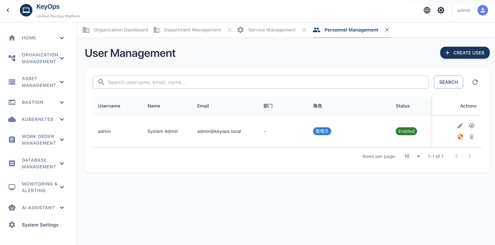

# KeyOps - Infrastructure Management Platform

**English** (default) | [中文](README.zh.md)

---

**Screenshots**


**Enterprise-grade DevOps platform built with Go**

## Core Features

### Feature Overview

| Category | Feature | Description | Status |
|---------|---------|-------------|--------|
| **🛡️ Bastion Host** | 🔐 SSH Gateway | Standard SSH protocol direct connection, supports traditional SSH clients | ✅ |
| | 🌐 Web Terminal | WebSocket real-time terminal, no client installation required, supports multi-session management | ✅ |
| | 🖥️ RDP Graphical | Windows remote desktop connection with GUI support | ✅ |
| | 🎥 Session Recording | Complete session recording and playback, supports Asciinema format | ✅ |
| | 📝 Command History | Complete command execution history and query | ✅ |
| | 📁 File Transfer | File upload/download management, supports SFTP protocol | ✅ |
| | 🚨 Command Interception | Real-time detection of dangerous commands, supports command blacklist, Feishu/DingTalk alerts | ✅ |
| | 👤 System User Management | Unified management of system users (jump users) and key distribution | ✅ |
| | 🔑 Two-Factor Authentication | Multiple authentication methods: Password / SSH key | ✅ |
| **🤖 AI Assistant** | 🤖 Smart Chat | Natural-language ops assistant with Prometheus/Grafana/K8s tool sets, multi-turn dialogue and context | ✅ |
| | 📋 Session Management | Session list, history, multi-session switching | ✅ |
| | ⏰ Scheduled Tasks | Scheduled expert dialogue and task execution | ✅ |
| **☸️ K8s Multi-Cluster** | 🌐 Cluster Management | Unified multi-cluster management, supports Token/Kubeconfig authentication | ✅ |
| | 🔐 Cluster Permissions | User/role-based cluster access control, supports namespace isolation | ✅ |
| | 📦 Workloads | Management of Deployment, DaemonSet, StatefulSet, Pod, CronJob | ✅ |
| | ⚙️ Config Management | Unified management and editing of ConfigMap and Secret | ✅ |
| | 🌐 Service Management | Creation and management of Service and Ingress | ✅ |
| | 💾 Storage Management | Configuration and management of PV, PVC, StorageClass | ✅ |
| | 📊 Cluster Monitoring | Cluster status overview, resource usage monitoring, event viewing | ✅ |
| | 📋 Operation Audit | Complete audit logs for K8s operations | ✅ |
| **📋 Ticket Management** | 📝 Ticket Creation | Supports daily tickets, deployment tickets, and other types | ✅ |
| | 📑 Form Templates | Visual form designer, supports custom form templates | ✅ |
| | 🔄 Approval Workflow | Supports Feishu/DingTalk/WeChat Work/internal approval, multi-level approval process (WeChat Work callback pending) | ✅ |
| | ✅ Auto Authorization | Automatic authorization after approval, supports automatic application of permission rules | ✅ |
| | 📊 Ticket Statistics | Ticket status tracking, approval history, statistical analysis | ✅ |
| **🏢 Organization & Apps** | 👥 Department Management | Multi-level department structure management, supports department tree organization | ✅ |
| | 📱 Application Management | Application information management, associated with departments and personnel | ✅ |
| | 👤 Personnel Management | User information management, supports department association and role assignment | ✅ |
| | 🔧 Service Management | Service catalog management, supports service classification and detail configuration | ✅ |
| **🔐 Polymorphic Permissions** | 👥 User Groups (Roles) | Role-based permission management, supports role member management | ✅ |
| | 🖥️ Host Groups | Host grouping management, supports batch authorization of host group permissions | ✅ |
| | 👤 System Users | Association of system users with permission rules, supports many-to-many relationships | ✅ |
| | ⏰ Time Restrictions | Permission rules support time range restrictions (valid from/to) | ✅ |
| | 🎯 Priority Control | Permission rules support priority settings, high-priority rules matched first | ✅ |
| | 📍 Fine-grained Permissions | Supports multi-dimensional permission combinations: host groups, specific hosts, system users | ✅ |
| **📈 Monitoring & Alerts** | 📊 Prometheus Monitoring | Prometheus datasource integration, supports monitoring metric queries | ✅ |
| | 📋 Alert Rules | Alert rule management, supports PromQL expressions; table with sticky columns, horizontal scroll, ellipsis on overflow | ✅ |
| | 📋 Rule Groups | Rule group management, sidebar stays active on detail page; add existing rules to group with consistent list and pagination | ✅ |
| | 🎯 Alert Policies | Alert policy configuration, supports alert aggregation, suppression, silence | ✅ |
| | 📢 Alert Notifications | Multi-channel alert notifications (Feishu/DingTalk/Email/Webhook) | ✅ |
| | 📝 Alert Templates | Custom alert message templates, supports variable substitution | ✅ |
| | 📊 Alert Events | Alert event management, supports alert acknowledgment, handling, recovery | ✅ |
| | 🔔 Certificate Monitoring | SSL certificate expiration monitoring and alerts | ✅ |
| | 👨‍💼 OnCall Management | OnCall shift management, supports duty calendar and notifications | ✅ |
| **💾 Database Management** | 🗄️ Multi-DB Support | Unified management of MySQL, PostgreSQL, MongoDB, Redis | ✅ |
| | 🔍 Query Function | SQL queries, MongoDB queries, Redis command execution | ✅ |
| | 📝 Query Logs | Complete query audit logs, records user, time, IP | ✅ |
| | 🔐 Fine-grained Permissions | Casbin-based permission control (instance → database → table → permission type) | ✅ |
| **🔧 Infrastructure** | 🌐 High Availability | Multi-instance deployment, Redis distributed locks, configuration synchronization | ✅ |
| | 📊 Asset Synchronization | Automatic asset synchronization with Prometheus, automatic host information updates | ✅ |
| | 🔍 Host Monitoring | Real-time host online status monitoring, health checks | ✅ |

## Quick Deployment

### Requirements

- Docker 20.10+
- Docker Compose 2.0+

### MySQL Deployment (Recommended)

```bash
# Start all services
docker-compose up -d

# View logs
docker-compose logs -f

# Stop services
docker-compose down
```

**Access System**: http://localhost:8080  
**Default Account**: `admin` / `admin123`

### PostgreSQL Deployment

**Modify environment variables** in `.env` file:

```bash
docker-compose -f docker-compose-pg.yaml up -d

DB_DRIVER=postgres
DB_HOST=postgres
DB_PORT=5432
DB_USER=postgres
DB_PASSWORD=postgres
DB_NAME=keyops
```

## Port Description

- `8080`: HTTP (Web + API)
- `2222`: SSH Gateway
- `3306`: MySQL (optional)
- `5432`: PostgreSQL (optional)
- `6379`: Redis (optional)
- `4822`: Guacamole daemon (RDP)

## Environment Variables Configuration

Create `.env` file (optional):

```bash
# Database configuration
MYSQL_ROOT_PASSWORD=123456
MYSQL_DATABASE=keyops
POSTGRES_USER=postgres
POSTGRES_PASSWORD=postgres
POSTGRES_DB=keyops

# Redis configuration
REDIS_ENABLED=true
REDIS_PASSWORD=
```

## License

This project is licensed under the MIT License - see the [LICENSE](LICENSE) file for details.
